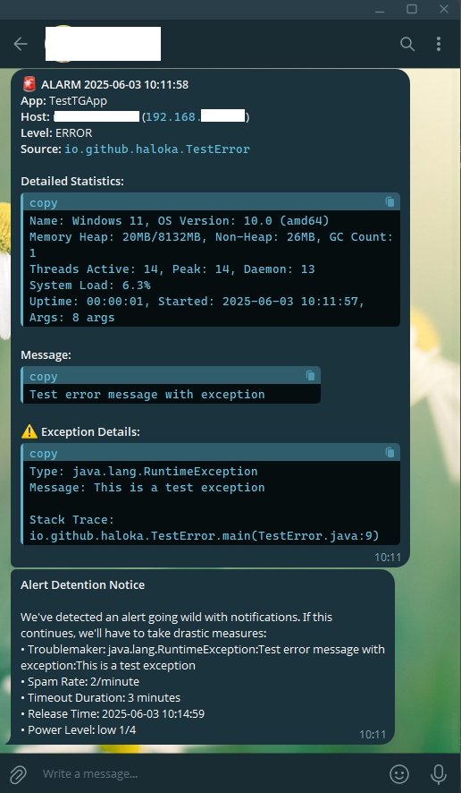

# Telegram Logback Appender

A Logback appender that sends log messages to Telegram with rich formatting and intelligent alert suppression. 
It provides comprehensive system statistics, error details, and rate limiting to prevent notification spam.

## Features

- 📱 Rich Telegram message formatting with system statistics
- 🛡️ Intelligent alert suppression to prevent notification spam
- ⚡ Asynchronous message processing with configurable thread pool
- 📊 Detailed system statistics including memory, threads, and GC metrics
- 🔄 Rate limiting with configurable thresholds
- 🌐 Configurable HTTP client settings
- 🕒 Timezone support for accurate timestamps



## Message Format

Error messages are formatted with:
- Timestamp and severity level
- Host and application information
- Error message and stack trace
- System metrics
- Context data (MDC)

Example: Exception message with system metrics
```
🚨 ALARM 2024-01-15 10:30:45
App: MyApplication
Host: prod-server-1 (192.168.1.100)
Level: ERROR
Source: com.example.MyService

🔍 Context Info:
traceId: 6761082bf3ef78defc655e06b0e7f2f9
spanId: fc655e06b0e7f2f9

Detailed Statistics:
Name: Windows 11, OS Version: 10.0 (amd64)
Heap: 24MB/8132MB, Non-Heap: 25MB, GC Count: 1
Threads Active: 13, Peak: 13, Daemon: 12
System Load: 3.8%
Uptime: 00:00:01, Started: 2024-12-17 14:00:50, Args: 7 args

Message:
Failed to process payment

⚠️ Exception Details:
Type: com.manka.exception.BaseException
Message: your payment failed

Stack Trace:
com.yourcompany.MyService.processPayment(MyService.java:42)
jakarta.servlet.http.HttpServlet.service(HttpServlet.java:547)
jakarta.servlet.http.HttpServlet.service(HttpServlet.java:614)
io.undertow.servlet.handlers.ServletHandler.handleRequest(ServletHandler.java:74)
io.undertow.servlet.handlers.FilterHandler$FilterChainImpl.doFilter(FilterHandler.java:129)
io.undertow.servlet.core.ManagedFilter.doFilter(ManagedFilter.java:67)
io.undertow.servlet.handlers.FilterHandler$FilterChainImpl.doFilter(FilterHandler.java:131)
... 70 more lines
```


## Getting Started

### 1. Add Dependency

Add the following dependency to your `pom.xml`: ~

```xml
<dependency>
    <groupId>io.github.haloka</groupId>
    <artifactId>telegram-logback-appender</artifactId>
    <version>1.0</version>
</dependency>
```

### 2. Create Telegram Bot

1. Start a chat with [@BotFather](https://t.me/BotFather) on Telegram
2. Send `/newbot` and follow the instructions
3. Save the bot token provided by BotFather

### 3. Get Chat ID

There are several ways to get your Telegram chat ID:

1. Start a chat with [@userinfobot](https://t.me/userinfobot)
2. Or use your bot token with this URL: `https://api.telegram.org/bot<YourBOTToken>/getUpdates`
    - Send a message to your bot first
    - Access the URL in your browser
    - Look for `"chat":{"id":123456789}` in the response

### 4. Minimal Configuration

Add the following to your `logback.xml`:

```xml
<configuration>
    <appender name="TELEGRAM" class="io.github.haloka.telegram.logback.TelegramAppender">
        <url>https://api.telegram.org/bot{0}/sendMessage</url>
        <botToken>YOUR_BOT_TOKEN</botToken>
        <chatId>YOUR_CHAT_ID</chatId>
        <appName>YourAppName</appName>

        <filter class="ch.qos.logback.classic.filter.ThresholdFilter">
            <level>ERROR</level>
        </filter>
    </appender>

    <root level="INFO">
        <appender-ref ref="TELEGRAM" />
    </root>
</configuration>
```

## Advanced Configuration

## Advanced Features

### Alert Suppression

The appender includes an intelligent alert suppression mechanism that prevents alert fatigue by:
- Grouping similar errors
- Implementing progressive suppression periods
- Providing clear suppression notifications
- Auto-escalating for persistent issues

Suppression levels (need to be configured, default is disabled):
1. 2 alerts/min → 3 minutes suppression
2. 5 alerts/min → 10 minutes suppression
3. 15 alerts/min → 20 minutes suppression
4. 25 alerts/min → 4 hours suppression


### Complete Configuration Example

```xml
<configuration>
    <appender name="TELEGRAM" class="io.github.haloka.telegram.logback.TelegramAppender">
        <!-- Required Settings -->
        <url>https://api.telegram.org/bot{0}/sendMessage</url>
        <botToken>YOUR_BOT_TOKEN</botToken>
        <chatId>YOUR_CHAT_ID</chatId>
        <appName>YourAppName</appName>

        <!-- Optional Settings. [Defaults value] -->
        <timezone>Asia/Tokyo</timezone>

        <!-- Alert Suppression Configuration -->
        <windowSize>PT1M</windowSize>
        <guardStage>
            <count>2</count>
            <duration>PT3M</duration>
            <label>Info</label>
        </guardStage>
        <guardStage>
            <count>5</count>
            <duration>PT10M</duration>
            <label>Warning</label>
        </guardStage>
        <guardStage>
            <count>15</count>
            <duration>PT20M</duration>
            <label>Error</label>
        </guardStage>
        <guardStage>
            <count>25</count>
            <duration>PT4H</duration>
            <label>Critical</label>
        </guardStage>
        
        <!-- HTTP Client Configuration. [Defaults values] -->
        <httpConnectTimeout>PT10S</httpConnectTimeout>
        <httpReadTimeout>PT10S</httpReadTimeout>
        <httpFollowRedirects>true</httpFollowRedirects>

        <!-- Thread Pool Configuration. [Defaults values] -->
        <threadCorePoolSize>2</threadCorePoolSize>
        <threadMaxPoolSize>2</threadMaxPoolSize>
        <threadQueueCapacity>500</threadQueueCapacity>
        <threadKeepAliveTime>PT1M</threadKeepAliveTime>

        <!-- Rate Limiting. [Defaults values] -->
        <rateLimitMaxMessages>20</rateLimitMaxMessages>
        <rateLimitWindow>PT1M</rateLimitWindow>

        <filter class="ch.qos.logback.classic.filter.ThresholdFilter">
            <level>ERROR</level>
        </filter>
    </appender>

    <root level="INFO">
        <appender-ref ref="TELEGRAM" />
    </root>
</configuration>
```

### Configuration Properties

#### Required Settings
- `url`: Telegram Bot API URL template (default: https://api.telegram.org/bot{0}/sendMessage)
- `botToken`: Your Telegram Bot token
- `chatId`: Target chat ID for notifications
- `appName`: Your application name

#### Optional Settings
- `timezone`: Timezone for log timestamps (default: Asia/Tokyo)

#### Alert Suppression
- `suppressionWindowSize`: Time window for counting alerts (ISO-8601 duration format)
- `suppressionStage`: Multiple stages can be configured
    - `count`: Number of alerts to trigger this stage
    - `duration`: Suppression duration
    - `label`: Stage label for notifications

#### HTTP Client
- `httpConnectTimeout`: Connection timeout (ISO-8601 duration)
- `httpReadTimeout`: Read timeout (ISO-8601 duration)
- `httpFollowRedirects`: Whether to follow HTTP redirects

#### Thread Pool
- `threadCorePoolSize`: Core thread pool size
- `threadMaxPoolSize`: Maximum thread pool size
- `threadQueueCapacity`: Message queue capacity
- `threadKeepAliveTime`: Thread keep-alive time

#### Rate Limiting
- `rateLimitMaxMessages`: Maximum messages per window
- `rateLimitWindow`: Rate limiting window duration


## Contributing

Contributions are welcome! Please feel free to submit a Pull Request.

## License

This project is licensed under the MIT License - see the [LICENSE](LICENSE) file for details.
